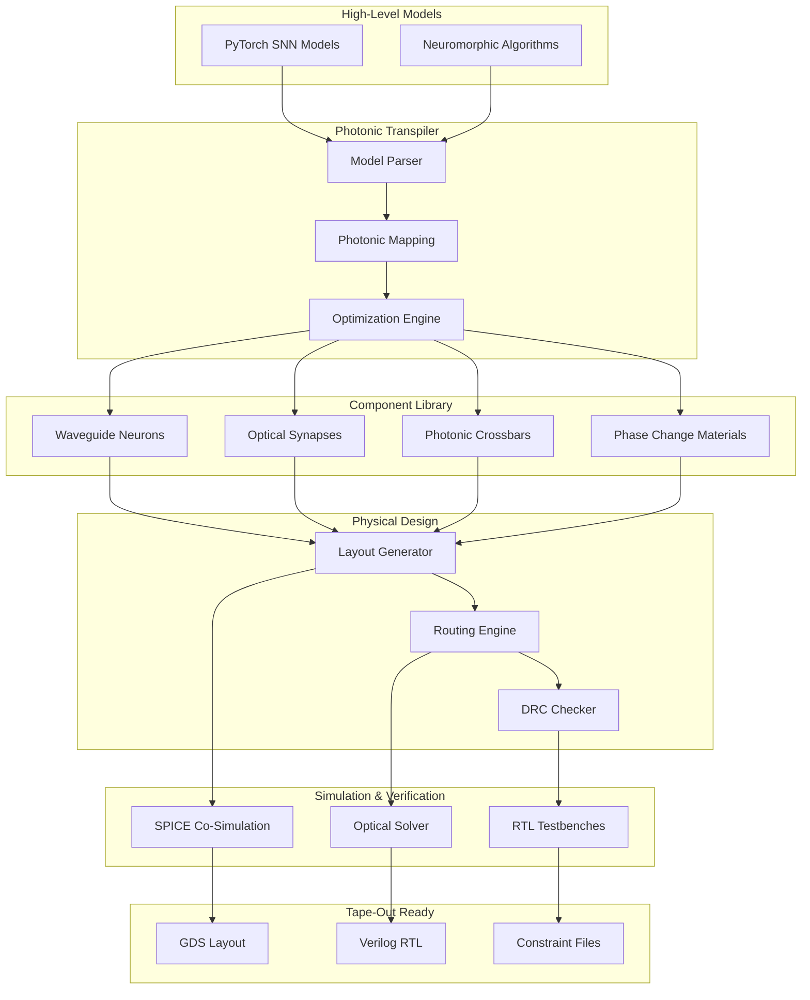
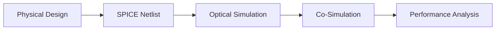

# Architecture Documentation

## System Overview

The photonic-neuromorphics-sim framework provides a complete design flow from high-level neuromorphic algorithms to silicon-photonic hardware implementation. This document outlines the system architecture, data flow, and component relationships.

## High-Level Architecture



## Core Components

### 1. Photonic Transpiler
**Purpose**: Converts high-level neural network models to photonic implementations

**Key Modules**:
- `ModelParser`: Analyzes PyTorch/TensorFlow models
- `PhotonicMapper`: Maps operations to optical components
- `OptimizationEngine`: Minimizes loss, crosstalk, and area

**Data Flow**:
```
PyTorch Model → Graph Analysis → Component Selection → Layout Optimization → Physical Design
```

### 2. Optical Component Library
**Purpose**: Provides validated photonic building blocks

**Component Types**:
- **Neurons**: Mach-Zehnder interferometers, microring resonators
- **Synapses**: Phase-change materials, electro-optic modulators
- **Interconnects**: Waveguides, splitters, combiners
- **Detection**: Photodetectors, TIA circuits

### 3. Co-Simulation Framework
**Purpose**: Unified optical-electrical simulation environment

**Simulation Engines**:
- **Optical**: FDTD, beam propagation method
- **Electrical**: SPICE, Verilog simulation
- **Thermal**: Heat dissipation modeling
- **Noise**: Shot noise, thermal noise, phase noise

### 4. RTL Generation Pipeline
**Purpose**: Automatic hardware description generation

**Generation Stages**:
1. Behavioral model extraction
2. Pipeline architecture mapping
3. Resource sharing optimization
4. Timing constraint generation
5. Testbench creation

## Data Flow Architecture

### Input Processing


### Photonic Compilation


### Simulation Flow


## Technology Stack

### Software Dependencies
- **Python 3.9+**: Core simulation engine
- **PyTorch**: Neural network frontend
- **NumPy/SciPy**: Numerical computations
- **Matplotlib**: Visualization
- **NetworkX**: Graph algorithms

### Hardware Tools
- **OpenLane**: ASIC design flow
- **Magic**: Layout editor and DRC
- **Ngspice**: Circuit simulation
- **KLayout**: GDS manipulation

### Photonic PDKs
- **SiEPIC EBeam**: Silicon photonics
- **SkyWater 130nm**: Hybrid CMOS-photonic
- **GlobalFoundries**: Advanced nodes

## Performance Characteristics

### Scalability Targets
| Metric | Current | Target |
|--------|---------|--------|
| Neurons | 1K | 1M |
| Synapses | 100K | 1B |
| Simulation Speed | 1x | 1000x |
| Memory Usage | 1GB | 10GB |

### Energy Efficiency
| Operation | Electronic | Photonic | Improvement |
|-----------|------------|----------|-----------|
| Spike Generation | 50 pJ | 0.1 pJ | 500× |
| Synaptic Transmission | 1 pJ | 0.01 pJ | 100× |
| Weight Update | 100 pJ | 10 pJ | 10× |

## Security & Reliability

### Design Rule Compliance
- Automated DRC checking for all PDKs
- Layout vs. schematic verification
- Electrical rule checking (ERC)
- Antenna rule compliance

### Simulation Accuracy
- Monte Carlo process variation analysis
- Temperature-dependent modeling
- Aging and reliability simulation
- Corner case validation

## Extension Points

### Adding New Components
1. Implement component class inheriting from `PhotonicComponent`
2. Define SPICE model and layout generation
3. Add validation tests and benchmarks
4. Update component library registry

### Custom PDK Integration
1. Create PDK configuration file
2. Define design rules and constraints
3. Implement layout generation rules
4. Add process-specific models

### Algorithm Extensions
1. Implement new neural network layers
2. Add optimization algorithms
3. Extend routing capabilities
4. Enhance co-simulation models

## Future Roadmap

### Short Term (3-6 months)
- Advanced noise modeling
- Multi-wavelength operation
- Automated testing framework
- Performance benchmarking suite

### Medium Term (6-12 months)
- Machine learning-assisted optimization
- 3D photonic integration
- Advanced packaging models
- Real-time simulation acceleration

### Long Term (1-2 years)
- Quantum-photonic extensions
- Neuromorphic learning algorithms
- Advanced materials integration
- Production-ready tools
