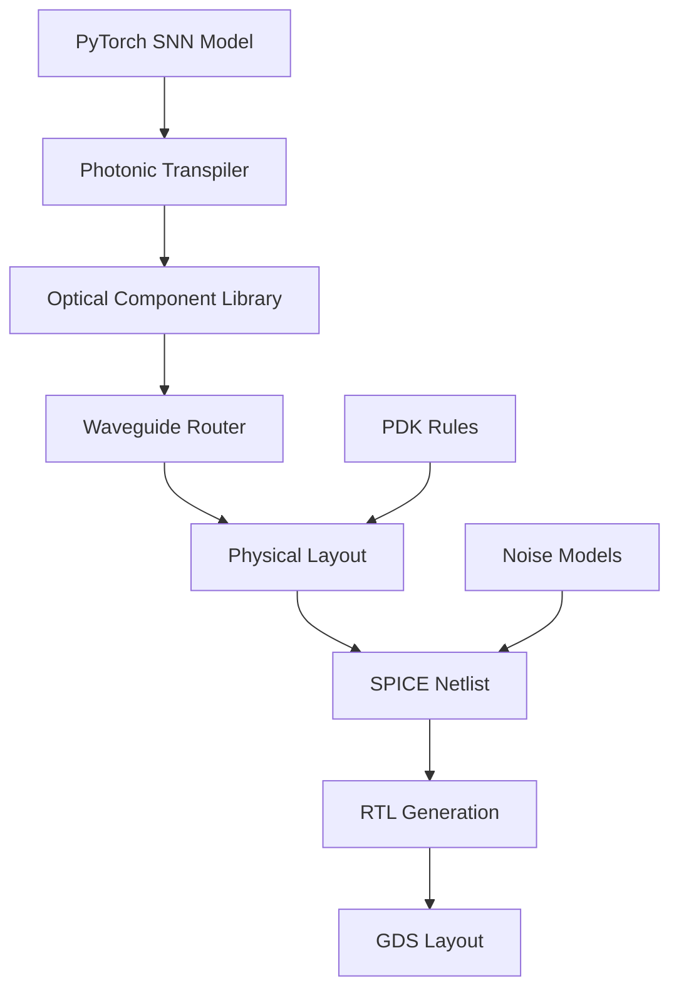

# photonic-neuromorphics-sim

> Verilog + Python playground that models silicon-photonic spiking neurons and cross-bar synapses, then auto-generates RTL for MPW tape-outs

[](https://opensource.org/licenses/MIT)
[](https://www.python.org/downloads/)
[](https://www.systemverilog.io/)
[](https://github.com/The-OpenROAD-Project/OpenLane)

## 🧠 Overview

**photonic-neuromorphics-sim** provides a complete design flow from high-level neuromorphic algorithms to silicon-photonic hardware implementation. Based on the 2025 VLSI Symposium workshop highlighting CMOS + photonics analog in-memory AI cores achieving sub-mW inference, this toolkit enables researchers to prototype and tape out photonic spiking neural networks.

## ✨ Key Features

- **Waveguide-Level SPICE Models**: Accurate optical component simulation
- **Noise/Dispersion Analysis**: Realistic photonic behavior modeling
- **PyTorch-to-Photons Transpiler**: Automatic conversion of neural networks
- **RTL Generation**: Tape-out ready Verilog for MPW shuttles
- **Co-Simulation**: Unified optical-electrical simulation environment

## 📊 Performance Targets

| Metric | Electronic SNN | Photonic SNN | Improvement |
|--------|----------------|--------------|-------------|
| Energy/Spike | 50 pJ | 0.1 pJ | 500× |
| Propagation Delay | 1 ns | 10 ps | 100× |
| Synaptic Density | 10⁸/cm² | 10¹⁰/cm² | 100× |
| Power (1M neurons) | 10 W | 0.5 W | 20× |

## 🚀 Quick Start

### Installation

```bash
# Clone repository
git clone https://github.com/yourusername/photonic-neuromorphics-sim.git
cd photonic-neuromorphics-sim

# Install Python environment
conda create -n photonic-neuro python=3.9
conda activate photonic-neuro
pip install -r requirements.txt

# Install Verilog tools
./scripts/install_openlane.sh
./scripts/install_magic.sh
./scripts/install_ngspice.sh
```

### Basic Example

```python
from photonic_neuromorphics import PhotonicSNN, WaveguideNeuron
import torch

# Define photonic spiking neural network
model = PhotonicSNN(
    neuron_type=WaveguideNeuron,
    topology=[784, 256, 128, 10],  # MNIST example
    synapse_type="phase_change",
    wavelength=1550e-9  # 1550nm
)

# Simulate with optical parameters
simulator = PhotonicSimulator(
    propagation_loss=0.1,  # dB/cm
    coupling_efficiency=0.9,
    detector_efficiency=0.8
)

# Run spike-based inference
spike_train = encode_to_spikes(mnist_image)
output_spikes = simulator.run(model, spike_train, duration=100e-9)

# Generate RTL for fabrication
rtl_generator = RTLGenerator(
    technology="skywater130",
    photonic_pdk="SiEPIC"
)
verilog_code = rtl_generator.generate(model)
rtl_generator.save("photonic_snn.v")
```

### Waveguide Neuron Design

```python
from photonic_neuromorphics.components import MachZehnderNeuron

# Design Mach-Zehnder interferometer neuron
neuron = MachZehnderNeuron(
    arm_length=100e-6,  # 100 μm
    phase_shifter_type="thermal",
    modulation_depth=0.9,
    threshold_power=1e-6  # 1 μW
)

# Analyze transfer function
transfer = neuron.get_transfer_function()
neuron.plot_response(wavelength_range=(1540e-9, 1560e-9))

# Generate SPICE model
spice_model = neuron.to_spice()
print(spice_model)
```

## 🏗️ Architecture

### System Overview



### Component Library

```python
# Core photonic components
from photonic_neuromorphics.library import (
    WaveguideCrossing,
    MicroringResonator,
    MachZehnderModulator,
    PhotonicCrystalCavity,
    PhaseChangeMaterial
)

# Build complex neuron
class PhotonicLIFNeuron:
    def __init__(self):
        self.integrator = MicroringResonator(
            radius=10e-6,
            coupling_gap=200e-9,
            quality_factor=10000
        )
        
        self.threshold = MachZehnderModulator(
            length=50e-6,
            vpi=3.0  # V
        )
        
        self.reset = PhaseChangeMaterial(
            material="GST",
            switching_energy=100e-15  # 100 fJ
        )
    
    def to_layout(self):
        # Generate photonic layout
        return self.auto_route_components()
```

## 🔬 Simulation Framework

### Optical-Electrical Co-Simulation

```verilog
// photonic_neuron.sv
module photonic_neuron #(
    parameter WAVELENGTH = 1550,  // nm
    parameter THRESHOLD = 1.0e-6   // W
)(
    input wire optical_in,
    output wire spike_out,
    input wire [7:0] weight,
    input wire clk, rst_n
);

    // Photonic components
    real optical_power;
    real phase_shift;
    
    // Optical simulation interface
    initial begin
        $optical_model("mach_zehnder.sp");
        $optical_param("wavelength", WAVELENGTH);
    end
    
    // Spike generation
    always @(posedge clk) begin
        if (!rst_n) begin
            spike_out <= 1'b0;
        end else begin
            optical_power = $optical_sim(optical_in, phase_shift);
            spike_out <= (optical_power > THRESHOLD);
        end
    end
    
endmodule
```

### SPICE Integration

```python
from photonic_neuromorphics.spice import PhotonicSPICE

# Create SPICE model with optical elements
spice = PhotonicSPICE()

# Add waveguide model
spice.add_waveguide(
    name="wg1",
    length=1e-3,  # 1mm
    width=450e-9,
    loss=0.1  # dB/cm
)

# Add photodetector
spice.add_photodetector(
    name="pd1",
    responsivity=0.8,  # A/W
    capacitance=10e-15,  # 10 fF
    dark_current=1e-9  # 1 nA
)

# Run transient simulation
results = spice.transient(
    stop_time=1e-6,
    step_time=1e-12,
    optical_input="pulse(0 1e-3 10n 1n 1n 50n 100n)"
)

spice.plot_results(results)
```

## 🎨 RTL Generation

### Automatic Verilog Generation

```python
from photonic_neuromorphics.rtl import PhotonicRTLGenerator

generator = PhotonicRTLGenerator(
    target_frequency=1e9,  # 1 GHz
    pipeline_stages=3
)

# Generate from high-level model
rtl_design = generator.from_model(
    model=photonic_snn,
    optimization_level=2,
    resource_sharing=True
)

# Add testbench
testbench = generator.create_testbench(
    rtl_design,
    test_vectors="mnist_spikes.txt"
)

# Verify functionality
sim_results = generator.simulate(testbench)
assert sim_results.passed, "RTL simulation failed"

# Generate synthesis scripts
generator.create_synthesis_scripts(
    rtl_design,
    target="skywater130",
    constraints={
        "max_area": 1e6,  # μm²
        "max_power": 10e-3  # 10 mW
    }
)
```

### OpenLane Flow Integration

```bash
# Run OpenLane flow
./flow.tcl -design photonic_snn -tag mpw_8

# Check results
python scripts/analyze_results.py \
    --design photonic_snn \
    --metrics "area,power,timing"
```

## 📊 Benchmarking

### Neuromorphic Benchmarks

```python
from photonic_neuromorphics.benchmarks import NeuromorphicBenchmark

benchmark = NeuromorphicBenchmark()

# Standard tasks
tasks = [
    "mnist_classification",
    "n_mnist_spatiotemporal",
    "dvsgesture_recognition",
    "spoken_digits"
]

for task in tasks:
    # Run on photonic hardware
    photonic_results = benchmark.run(
        model=photonic_snn,
        task=task,
        simulator="photonic"
    )
    
    # Compare with electronic baseline
    electronic_results = benchmark.run(
        model=electronic_snn,
        task=task,
        simulator="electronic"
    )
    
    print(f"\n{task}:")
    print(f"  Photonic - Accuracy: {photonic_results.accuracy:.2%}, "
          f"Energy: {photonic_results.energy_per_inf:.2e} J")
    print(f"  Electronic - Accuracy: {electronic_results.accuracy:.2%}, "
          f"Energy: {electronic_results.energy_per_inf:.2e} J")
    print(f"  Energy improvement: {electronic_results.energy_per_inf / photonic_results.energy_per_inf:.1f}×")
```

## 🛠️ Design Examples

### Optical Crossbar Array

```python
from photonic_neuromorphics.architectures import PhotonicCrossbar

# Design 64x64 optical crossbar
crossbar = PhotonicCrossbar(
    rows=64,
    cols=64,
    weight_bits=8,
    modulator_type="microring",
    routing_algorithm="minimize_crossings"
)

# Set synaptic weights
weights = torch.randn(64, 64)
crossbar.program_weights(weights)

# Analyze optical losses
loss_analysis = crossbar.analyze_losses()
print(f"Worst-case insertion loss: {loss_analysis.max_loss:.1f} dB")
print(f"Crosstalk: {loss_analysis.crosstalk:.1f} dB")

# Generate layout
layout = crossbar.generate_layout()
layout.export_gds("crossbar_64x64.gds")
```

### Photonic Reservoir Computing

```python
from photonic_neuromorphics.reservoir import PhotonicReservoir

# Create photonic reservoir
reservoir = PhotonicReservoir(
    nodes=100,
    connectivity=0.1,
    delay_distribution="exponential",
    nonlinearity="semiconductor_optical_amplifier"
)

# Train readout layer only
X_train, y_train = load_temporal_data()
reservoir.train_readout(X_train, y_train)

# Test on chaotic time series
predictions = reservoir.predict(X_test)
print(f"NMSE: {calculate_nmse(predictions, y_test):.4f}")
```

## 📈 Tape-Out Preparation

### Design Rule Checking

```python
from photonic_neuromorphics.verification import PhotonicDRC

drc = PhotonicDRC(
    rules="SiEPIC_EBeam_PDK",
    technology="SOI_220nm"
)

# Run checks
violations = drc.check_design("photonic_snn.gds")

for violation in violations:
    print(f"{violation.rule}: {violation.description} at {violation.location}")

# Auto-fix common issues
drc.auto_fix_violations(violations)
```

### Multi-Project Wafer Submission

```yaml
# mpw_config.yaml
project:
  name: photonic_neuromorphics_snn
  technology: skywater130
  photonic_layer: SiN_400nm
  
area:
  width: 2000  # μm
  height: 2000
  
io:
  optical_inputs: 8
  optical_outputs: 8
  electrical_pads: 40
  
testbench:
  optical_sources: 
    - wavelength: 1550nm
      power: 1mW
  detectors:
    - type: germanium
      responsivity: 0.8
```

## 🔧 Debugging Tools

### Optical Signal Analyzer

```python
from photonic_neuromorphics.debug import OpticalAnalyzer

analyzer = OpticalAnalyzer()

# Probe internal signals
analyzer.probe("neuron_5/integrator", metric="optical_power")
analyzer.probe("synapse_2_3", metric="phase_shift")

# Run simulation with probes
results = simulator.run_with_probes(model, input_spikes)

# Visualize optical signals
analyzer.plot_timeline(results, start=0, end=100e-9)
analyzer.plot_spectrum(results, center=1550e-9, span=40e-9)
```

## 📚 Documentation

Full documentation: [https://photonic-neuromorphics.readthedocs.io](https://photonic-neuromorphics.readthedocs.io)

### Tutorials
- [Introduction to Photonic Neuromorphics](docs/tutorials/01_introduction.md)
- [Designing Photonic Neurons](docs/tutorials/02_photonic_neurons.md)
- [RTL Generation Flow](docs/tutorials/03_rtl_generation.md)
- [Tape-Out Preparation](docs/tutorials/04_tapeout.md)

## 🤝 Contributing

We welcome contributions! Priority areas:
- Additional photonic neuron models
- Advanced routing algorithms
- Noise modeling improvements
- PDK expansions

See [CONTRIBUTING.md](CONTRIBUTING.md) for guidelines.

## 📄 Citation

```bibtex
@inproceedings{photonic_neuromorphics_sim,
  title={Silicon-Photonic Neuromorphic Design Framework},
  author={Your Name},
  booktitle={VLSI Symposium},
  year={2025}
}
```

## 🏆 Acknowledgments

- VLSI 2025 workshop organizers
- OpenLane development team
- SiEPIC PDK maintainers

## 📜 License

MIT License - see [LICENSE](LICENSE) for details.
