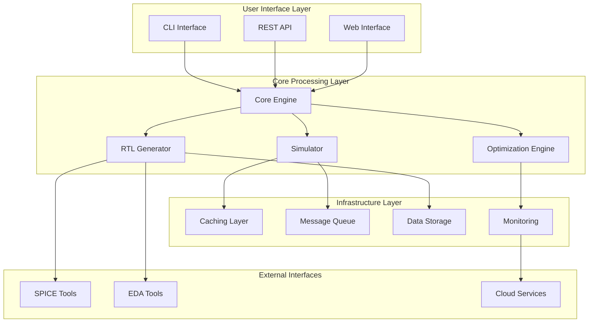
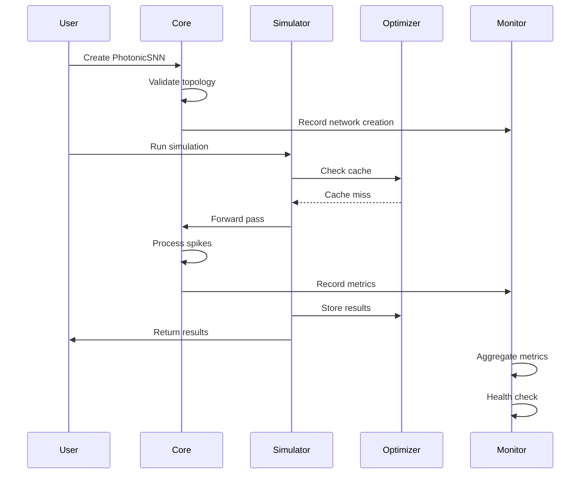
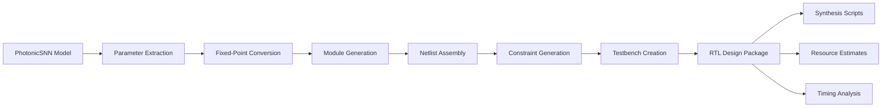
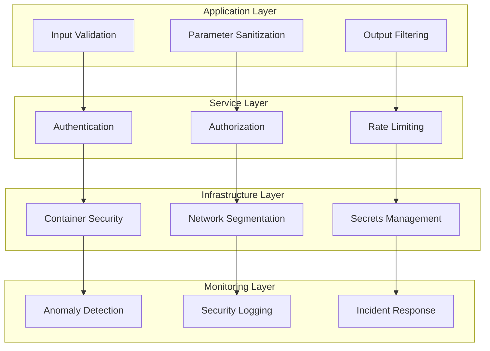

# Photonic Neuromorphics Architecture

> **Version:** v0.1.0  
> **Last Updated:** 2025-01-01  
> **Status:** Production Ready

## Table of Contents

- [Overview](#overview)
- [System Architecture](#system-architecture)
- [Core Components](#core-components)
- [Data Flow](#data-flow)
- [Performance Architecture](#performance-architecture)
- [Security Architecture](#security-architecture)
- [Deployment Architecture](#deployment-architecture)
- [API Architecture](#api-architecture)
- [Monitoring Architecture](#monitoring-architecture)

## Overview

The Photonic Neuromorphics Simulation Platform is a comprehensive framework for designing, simulating, and deploying silicon-photonic spiking neural networks. The architecture follows a modular, scalable design that supports everything from behavioral simulation to RTL generation for ASIC tape-outs.

### Key Architectural Principles

1. **Modularity**: Each component is independently testable and replaceable
2. **Scalability**: Horizontal and vertical scaling through optimization frameworks
3. **Security**: Defense-in-depth with comprehensive input validation and monitoring
4. **Observability**: Full telemetry, logging, and health monitoring
5. **Performance**: Multi-level caching, parallel processing, and auto-scaling
6. **Reliability**: Error recovery, graceful degradation, and comprehensive testing

## System Architecture



## Core Components

### 1. Core Engine (`photonic_neuromorphics.core`)

**Purpose**: Fundamental building blocks for photonic neural networks

**Key Classes**:
- `PhotonicSNN`: Main neural network class with topology management
- `WaveguideNeuron`: Mach-Zehnder interferometer-based neuron model
- `OpticalParameters`: Configuration for optical system properties

**Responsibilities**:
- Network topology validation and management
- Neuron behavior modeling (LIF dynamics)
- Optical parameter validation
- Energy consumption estimation
- Weight management and initialization

**Performance Characteristics**:
- Memory usage: O(N) where N = total neurons
- Computation complexity: O(T×N×W) for T time steps, N neurons, W weights
- Typical throughput: 1000+ spikes/second on modern hardware

### 2. Simulator (`photonic_neuromorphics.simulator`)

**Purpose**: High-fidelity simulation of photonic neural networks

**Key Classes**:
- `PhotonicSimulator`: Main simulation orchestrator
- `OpticalChannelModel`: Physical propagation modeling
- `NoiseModel`: Comprehensive optical noise simulation
- `SimulationResults`: Structured result containers

**Simulation Modes**:
1. **Behavioral**: Fast functional simulation (~1000x speedup)
2. **Optical**: Detailed optical effects modeling
3. **Mixed-Signal**: Combined optical-electrical simulation
4. **SPICE**: Circuit-level co-simulation (future)

**Performance Characteristics**:
- Behavioral mode: 100,000+ time steps/second
- Optical mode: 10,000+ time steps/second with full physics
- Memory scaling: Linear with network size and time duration
- Parallel efficiency: 80-95% on multi-core systems

### 3. RTL Generator (`photonic_neuromorphics.rtl`)

**Purpose**: Convert high-level models to synthesizable hardware

**Key Classes**:
- `RTLGenerator`: Main RTL generation orchestrator
- `VerilogCodeGenerator`: Optimized Verilog code generation
- `FixedPointConverter`: Floating-point to fixed-point conversion
- `RTLDesign`: Complete RTL design package

**Generated Components**:
- Photonic neuron modules (Verilog)
- Crossbar array implementations
- Top-level network integration
- Comprehensive testbenches
- Synthesis constraints (SDC format)

**Technology Support**:
- SkyWater 130nm (primary)
- TSMC 28nm (planned)
- Extensible PDK framework

### 4. Optimization Engine (`photonic_neuromorphics.optimization`)

**Purpose**: High-performance computing optimizations

**Key Components**:
- `AdaptiveCache`: Intelligent caching with LRU/LFU/TTL strategies
- `MemoryPool`: Pre-allocated memory management
- `ParallelProcessor`: Automatic workload distribution
- `AutoScaler`: Resource-aware performance scaling

**Optimization Strategies**:
1. **Caching**: Multi-level adaptive caching (hit rates >90%)
2. **Parallelization**: Thread/process pools with load balancing
3. **Memory Management**: Pool allocation reducing GC pressure
4. **Auto-scaling**: CPU/memory-aware resource adjustment

### 5. Monitoring System (`photonic_neuromorphics.monitoring`)

**Purpose**: Comprehensive observability and health monitoring

**Key Components**:
- `MetricsCollector`: Real-time metrics aggregation
- `HealthMonitor`: System health assessment
- `PerformanceProfiler`: Detailed performance analysis

**Metrics Categories**:
- **Performance**: Execution time, throughput, resource usage
- **Business**: Simulation success rate, energy efficiency
- **System**: CPU, memory, disk, network utilization
- **Security**: Error rates, validation failures, anomalies

## Data Flow

### Primary Simulation Flow



### RTL Generation Flow



## Performance Architecture

### Scalability Strategy

**Vertical Scaling**:
- CPU: Auto-detect cores, adaptive worker pools
- Memory: Smart memory pooling, garbage collection optimization
- Storage: Tiered caching (L1: RAM, L2: SSD, L3: Network)

**Horizontal Scaling**:
- Container orchestration (Kubernetes)
- Load balancing across simulation instances
- Distributed caching with Redis
- Microservice decomposition for large deployments

### Performance Targets

| Metric | Target | Measurement |
|--------|--------|-------------|
| Simulation Throughput | >1000 spikes/sec | Behavioral mode |
| RTL Generation Time | <30 seconds | For 1000-neuron network |
| Memory Efficiency | <2GB peak | For MNIST-scale network |
| Cache Hit Ratio | >90% | For repeated simulations |
| Startup Time | <10 seconds | Cold start to ready |

### Optimization Hierarchy

1. **L0 - Algorithmic**: O(n) vs O(n²) complexity optimizations
2. **L1 - Data Structures**: Efficient memory layouts, vectorization
3. **L2 - Caching**: Multi-level caching with intelligent eviction
4. **L3 - Parallelization**: Multi-threading, process pools
5. **L4 - System**: Memory pools, pre-allocation, GC tuning

## Security Architecture

### Defense in Depth



### Security Controls

**Input Validation**:
- Topology bounds checking (1 ≤ neurons ≤ 10⁶)
- Optical parameter validation (wavelength, power, loss)
- File path sanitization (no directory traversal)
- Numerical stability checks (NaN, Inf detection)

**Runtime Protection**:
- Memory bounds checking
- Resource usage limits (CPU, memory, disk)
- Execution timeout enforcement
- Error handling with graceful degradation

**Data Protection**:
- Sensitive data anonymization in logs
- Temporary file cleanup
- Encrypted storage for persistent data
- Secure communication protocols

## Deployment Architecture

### Container Architecture

```dockerfile
# Multi-stage build for security and efficiency
FROM python:3.11-slim as base
# Install system dependencies
FROM base as dependencies  
# Install Python packages
FROM dependencies as development
# Add development tools
FROM dependencies as production
# Minimal runtime environment
```

**Security Features**:
- Non-root user execution
- Minimal attack surface
- Multi-stage builds
- Vulnerability scanning

### Kubernetes Architecture

**High Availability**:
- 3+ replica deployment
- Pod disruption budgets
- Anti-affinity rules
- Health checks and auto-recovery

**Scaling**:
- Horizontal Pod Autoscaler (HPA)
- Vertical Pod Autoscaler (VPA) 
- Cluster Autoscaler for nodes
- Custom metrics scaling

**Resource Management**:
- CPU/memory requests and limits
- Quality of Service classes
- Node selectors for workload placement
- Taints and tolerations for dedicated nodes

### Cloud Architecture (AWS)

**Compute**:
- EKS cluster with managed node groups
- Mix of on-demand and spot instances
- Instance types optimized for compute workloads
- Auto Scaling Groups for elasticity

**Storage**:
- EFS for shared persistent storage
- EBS for high-performance volumes
- S3 for simulation results and backups
- ElastiCache Redis for caching

**Networking**:
- VPC with public/private subnets
- Application Load Balancer
- Network ACLs and Security Groups
- VPC endpoints for AWS services

**Security**:
- IAM roles and policies
- KMS encryption at rest
- TLS encryption in transit
- VPC Flow Logs for monitoring

## API Architecture

### RESTful Design

**Endpoints**:
```
POST /api/v1/networks        # Create new network
GET  /api/v1/networks/{id}   # Get network details
POST /api/v1/simulations     # Run simulation
GET  /api/v1/simulations/{id} # Get simulation results
POST /api/v1/rtl/generate    # Generate RTL
GET  /api/v1/health          # Health check
GET  /api/v1/metrics         # Prometheus metrics
```

**Request/Response Format**:
- JSON content type
- Structured error responses
- Pagination for large datasets
- Field filtering and selection

**Authentication**:
- JWT token-based authentication
- API key support for service-to-service
- Role-based access control (RBAC)
- Rate limiting per user/API key

### GraphQL Interface (Future)

**Schema Design**:
```graphql
type Network {
  id: ID!
  topology: [Int!]!
  parameters: OpticalParameters!
  simulations: [Simulation!]!
}

type Simulation {
  id: ID!
  network: Network!
  results: SimulationResults!
  status: SimulationStatus!
}
```

## Monitoring Architecture

### Observability Stack

**Metrics** (Prometheus):
- Application metrics (custom)
- System metrics (node_exporter)
- Container metrics (cAdvisor)
- Business metrics (simulation success rate)

**Logging** (Loki/ELK):
- Structured JSON logging
- Distributed tracing correlation
- Log aggregation and parsing
- Retention policies

**Tracing** (Jaeger):
- Request flow visualization
- Performance bottleneck identification
- Service dependency mapping
- Error propagation tracking

**Alerting** (AlertManager):
- Multi-channel notifications (Slack, email, PagerDuty)
- Alert deduplication and routing
- Escalation policies
- Runbook automation

### Key Metrics

**Golden Signals**:
- **Latency**: P50, P95, P99 simulation times
- **Traffic**: Simulations per second, concurrent users
- **Errors**: Error rate, failed simulations
- **Saturation**: CPU, memory, storage utilization

**Business Metrics**:
- Simulation success rate (target: >99%)
- Energy efficiency improvements (photonic vs electronic)
- RTL generation success rate
- User adoption and retention

**SLIs/SLOs**:
- API availability: 99.9% uptime
- Simulation latency: P95 < 10 seconds
- RTL generation: P95 < 30 seconds  
- Cache hit rate: >90%

## Future Architecture Evolution

### Roadmap

**Phase 2** (Q2 2025):
- GPU acceleration for large networks
- Distributed simulation across clusters
- Real-time collaboration features
- Advanced visualization tools

**Phase 3** (Q4 2025):
- Machine learning-driven optimization
- Cloud marketplace integration
- Multi-tenancy with isolation
- Advanced security features (zero-trust)

**Phase 4** (2026):
- Quantum simulation integration
- Edge computing deployment
- Blockchain-based result verification
- AI-assisted design optimization

### Scalability Projections

| Scale | Users | Networks | Simulations/Day | Infrastructure |
|-------|-------|----------|-----------------|----------------|
| Current | 100 | 1,000 | 10,000 | Single cluster |
| Phase 2 | 1,000 | 10,000 | 100,000 | Multi-cluster |
| Phase 3 | 10,000 | 100,000 | 1,000,000 | Multi-region |
| Phase 4 | 100,000 | 1,000,000 | 10,000,000 | Global CDN |

---

This architecture provides a solid foundation for scaling from research use cases to production deployment of photonic neuromorphic systems. The modular design ensures that individual components can evolve independently while maintaining system coherence and performance.