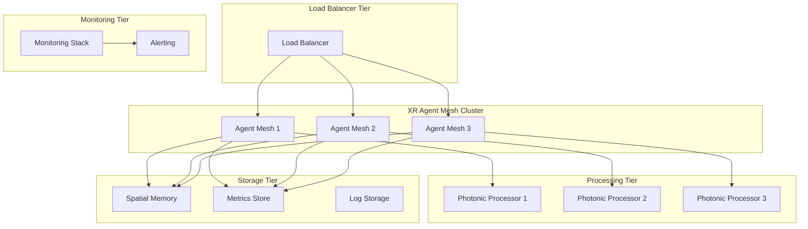

# XR Agent Mesh Production Deployment Guide

## 🚀 Overview

This guide provides comprehensive instructions for deploying the XR Agent Mesh system to production environments, including scaling, monitoring, and operational considerations.

## 📋 Prerequisites

### System Requirements

**Minimum Requirements:**
- CPU: 8 cores (Intel Xeon or AMD EPYC)
- Memory: 32GB RAM
- Storage: 100GB SSD
- Network: 10Gbps Ethernet
- OS: Ubuntu 22.04 LTS or RHEL 8+

**Recommended for Production:**
- CPU: 16+ cores with AVX-512 support
- Memory: 64GB+ RAM
- Storage: 500GB+ NVMe SSD
- Network: 25Gbps+ with low latency
- GPU: NVIDIA V100/A100 for accelerated processing

### Software Dependencies

```bash
# Python environment
Python 3.9+
pip 23.0+

# Core packages
numpy>=1.21.0
torch>=1.9.0
pydantic>=2.0.0
scipy>=1.7.0
matplotlib>=3.4.0

# Optional accelerated packages
mkl>=2021.0
openblas>=0.3.15
cuda>=11.0 (for GPU acceleration)
```

## 🏗️ Architecture Overview



## 🐳 Docker Deployment

### Multi-Stage Dockerfile

```dockerfile
# Build stage
FROM python:3.11-slim as builder

WORKDIR /app
COPY requirements*.txt ./
RUN pip install --user --no-cache-dir -r requirements.txt

# Production stage
FROM python:3.11-slim

# Install system dependencies
RUN apt-get update && apt-get install -y \
    libopenblas-dev \
    liblapack-dev \
    && rm -rf /var/lib/apt/lists/*

# Create non-root user
RUN useradd --create-home --shell /bin/bash xr-agent
USER xr-agent
WORKDIR /home/xr-agent

# Copy installed packages
COPY --from=builder /root/.local /home/xr-agent/.local
ENV PATH=/home/xr-agent/.local/bin:$PATH

# Copy application
COPY --chown=xr-agent:xr-agent src/ ./src/
COPY --chown=xr-agent:xr-agent examples/ ./examples/

# Set environment variables
ENV PYTHONPATH=/home/xr-agent/src
ENV XR_MESH_CONFIG=/home/xr-agent/config/mesh.yaml
ENV XR_LOG_LEVEL=INFO

# Health check
HEALTHCHECK --interval=30s --timeout=10s --start-period=60s --retries=3 \
  CMD python3 -c "import sys; sys.path.insert(0, 'src'); from photonic_neuromorphics.xr_agent_mesh import XRAgentMesh; print('OK')"

# Default command
CMD ["python3", "examples/xr_agent_mesh_demo.py"]
```

### Docker Compose for Development

```yaml
version: '3.8'

services:
  xr-mesh:
    build: .
    ports:
      - "8080:8080"
    environment:
      - XR_MESH_ID=dev-mesh
      - XR_OPTIMIZATION_LEVEL=enhanced
      - XR_METRICS_ENABLED=true
    volumes:
      - ./config:/home/xr-agent/config:ro
      - ./logs:/home/xr-agent/logs
    depends_on:
      - prometheus
      - redis
    networks:
      - xr-network

  prometheus:
    image: prom/prometheus:latest
    ports:
      - "9090:9090"
    volumes:
      - ./monitoring/prometheus.yml:/etc/prometheus/prometheus.yml:ro
    networks:
      - xr-network

  grafana:
    image: grafana/grafana:latest
    ports:
      - "3000:3000"
    environment:
      - GF_SECURITY_ADMIN_PASSWORD=admin
    volumes:
      - grafana-storage:/var/lib/grafana
      - ./monitoring/grafana/dashboards:/var/lib/grafana/dashboards:ro
    networks:
      - xr-network

  redis:
    image: redis:7-alpine
    ports:
      - "6379:6379"
    volumes:
      - redis-data:/data
    networks:
      - xr-network

volumes:
  grafana-storage:
  redis-data:

networks:
  xr-network:
    driver: bridge
```

## ☸️ Kubernetes Deployment

### Namespace

```yaml
apiVersion: v1
kind: Namespace
metadata:
  name: xr-mesh
  labels:
    name: xr-mesh
    environment: production
```

### ConfigMap

```yaml
apiVersion: v1
kind: ConfigMap
metadata:
  name: xr-mesh-config
  namespace: xr-mesh
data:
  mesh.yaml: |
    mesh:
      id: "prod-xr-mesh"
      optimization_level: "maximum"
      max_agents: 1000
      health_check_interval: 10.0
    
    processing:
      batch_size: 32
      timeout: 0.005
      max_workers: 16
    
    reliability:
      circuit_breaker_threshold: 5
      retry_max_attempts: 3
      health_monitor_interval: 5.0
    
    performance:
      memory_pool_size: 200
      cache_size: 1000
      enable_profiling: false
```

### Deployment

```yaml
apiVersion: apps/v1
kind: Deployment
metadata:
  name: xr-mesh
  namespace: xr-mesh
  labels:
    app: xr-mesh
spec:
  replicas: 3
  selector:
    matchLabels:
      app: xr-mesh
  template:
    metadata:
      labels:
        app: xr-mesh
    spec:
      containers:
      - name: xr-mesh
        image: xr-mesh:latest
        ports:
        - containerPort: 8080
        env:
        - name: XR_MESH_CONFIG
          value: "/config/mesh.yaml"
        - name: XR_LOG_LEVEL
          value: "INFO"
        - name: PYTHONUNBUFFERED
          value: "1"
        resources:
          requests:
            memory: "4Gi"
            cpu: "2000m"
          limits:
            memory: "8Gi"
            cpu: "4000m"
        volumeMounts:
        - name: config
          mountPath: /config
        - name: logs
          mountPath: /home/xr-agent/logs
        livenessProbe:
          httpGet:
            path: /health
            port: 8080
          initialDelaySeconds: 60
          periodSeconds: 30
        readinessProbe:
          httpGet:
            path: /ready
            port: 8080
          initialDelaySeconds: 30
          periodSeconds: 10
      volumes:
      - name: config
        configMap:
          name: xr-mesh-config
      - name: logs
        emptyDir: {}
```

### Service

```yaml
apiVersion: v1
kind: Service
metadata:
  name: xr-mesh-service
  namespace: xr-mesh
spec:
  selector:
    app: xr-mesh
  ports:
  - protocol: TCP
    port: 80
    targetPort: 8080
  type: ClusterIP
```

### HorizontalPodAutoscaler

```yaml
apiVersion: autoscaling/v2
kind: HorizontalPodAutoscaler
metadata:
  name: xr-mesh-hpa
  namespace: xr-mesh
spec:
  scaleTargetRef:
    apiVersion: apps/v1
    kind: Deployment
    name: xr-mesh
  minReplicas: 3
  maxReplicas: 20
  metrics:
  - type: Resource
    resource:
      name: cpu
      target:
        type: Utilization
        averageUtilization: 70
  - type: Resource
    resource:
      name: memory
      target:
        type: Utilization
        averageUtilization: 80
  behavior:
    scaleDown:
      stabilizationWindowSeconds: 300
      policies:
      - type: Percent
        value: 50
        periodSeconds: 60
    scaleUp:
      stabilizationWindowSeconds: 0
      policies:
      - type: Percent
        value: 100
        periodSeconds: 15
      - type: Pods
        value: 4
        periodSeconds: 15
      selectPolicy: Max
```

## 📊 Monitoring Configuration

### Prometheus Configuration

```yaml
global:
  scrape_interval: 15s
  evaluation_interval: 15s

rule_files:
  - "xr_alerts.yml"

scrape_configs:
  - job_name: 'xr-mesh'
    static_configs:
      - targets: ['xr-mesh-service:80']
    metrics_path: '/metrics'
    scrape_interval: 10s

  - job_name: 'node-exporter'
    static_configs:
      - targets: ['node-exporter:9100']

alerting:
  alertmanagers:
    - static_configs:
        - targets:
          - alertmanager:9093
```

### Alert Rules

```yaml
groups:
- name: xr-mesh-alerts
  rules:
  - alert: XRMeshHighErrorRate
    expr: rate(xr_processing_errors_total[5m]) > 0.1
    for: 2m
    labels:
      severity: warning
    annotations:
      summary: "High error rate in XR mesh"
      description: "Error rate is {{ $value }} errors per second"

  - alert: XRMeshHighLatency
    expr: histogram_quantile(0.95, rate(xr_processing_duration_seconds_bucket[5m])) > 0.01
    for: 5m
    labels:
      severity: warning
    annotations:
      summary: "High latency in XR processing"
      description: "95th percentile latency is {{ $value }}s"

  - alert: XRMeshMemoryUsage
    expr: process_memory_usage_ratio > 0.9
    for: 2m
    labels:
      severity: critical
    annotations:
      summary: "High memory usage in XR mesh"
      description: "Memory usage is {{ $value | humanizePercentage }}"

  - alert: XRMeshAgentDown
    expr: up{job="xr-mesh"} == 0
    for: 1m
    labels:
      severity: critical
    annotations:
      summary: "XR mesh agent is down"
      description: "XR mesh agent has been down for more than 1 minute"
```

## 🔧 Configuration Management

### Environment-Specific Configurations

**Development (config/dev.yaml):**
```yaml
mesh:
  optimization_level: "basic"
  max_agents: 10
  debug_mode: true

logging:
  level: "DEBUG"
  format: "detailed"

performance:
  enable_profiling: true
  metrics_interval: 1.0
```

**Staging (config/staging.yaml):**
```yaml
mesh:
  optimization_level: "enhanced"
  max_agents: 100
  debug_mode: false

logging:
  level: "INFO"
  format: "json"

performance:
  enable_profiling: false
  metrics_interval: 5.0
```

**Production (config/prod.yaml):**
```yaml
mesh:
  optimization_level: "maximum"
  max_agents: 1000
  debug_mode: false

logging:
  level: "WARNING"
  format: "json"

performance:
  enable_profiling: false
  metrics_interval: 10.0

security:
  enable_encryption: true
  certificate_path: "/certs/tls.crt"
  private_key_path: "/certs/tls.key"
```

## 🚦 Load Balancing

### NGINX Configuration

```nginx
upstream xr_mesh {
    least_conn;
    server xr-mesh-1:8080 max_fails=3 fail_timeout=30s;
    server xr-mesh-2:8080 max_fails=3 fail_timeout=30s;
    server xr-mesh-3:8080 max_fails=3 fail_timeout=30s;
}

server {
    listen 80;
    server_name xr-mesh.example.com;
    
    location / {
        proxy_pass http://xr_mesh;
        proxy_set_header Host $host;
        proxy_set_header X-Real-IP $remote_addr;
        proxy_set_header X-Forwarded-For $proxy_add_x_forwarded_for;
        proxy_set_header X-Forwarded-Proto $scheme;
        
        # Timeouts for XR processing
        proxy_connect_timeout 5s;
        proxy_send_timeout 30s;
        proxy_read_timeout 30s;
    }
    
    location /health {
        proxy_pass http://xr_mesh;
        access_log off;
    }
    
    location /metrics {
        proxy_pass http://xr_mesh;
        # Restrict access to monitoring
        allow 10.0.0.0/8;
        deny all;
    }
}
```

## 🔒 Security Considerations

### SSL/TLS Configuration

```bash
# Generate certificates
openssl req -x509 -newkey rsa:4096 -keyout key.pem -out cert.pem -days 365 -nodes

# Kubernetes secret
kubectl create secret tls xr-mesh-tls --cert=cert.pem --key=key.pem -n xr-mesh
```

### Network Policies

```yaml
apiVersion: networking.k8s.io/v1
kind: NetworkPolicy
metadata:
  name: xr-mesh-netpol
  namespace: xr-mesh
spec:
  podSelector:
    matchLabels:
      app: xr-mesh
  policyTypes:
  - Ingress
  - Egress
  ingress:
  - from:
    - namespaceSelector:
        matchLabels:
          name: monitoring
    - namespaceSelector:
        matchLabels:
          name: ingress
    ports:
    - protocol: TCP
      port: 8080
  egress:
  - to: []
    ports:
    - protocol: TCP
      port: 53
    - protocol: UDP
      port: 53
  - to:
    - namespaceSelector:
        matchLabels:
          name: monitoring
```

### Security Scanning

```bash
# Container security scan
trivy image xr-mesh:latest

# Dependency vulnerability scan
safety check -r requirements.txt

# Code security analysis
bandit -r src/ -f json -o security-report.json
```

## 📈 Performance Tuning

### System Optimization

```bash
# Kernel parameters for high-performance networking
echo 'net.core.rmem_max = 268435456' >> /etc/sysctl.conf
echo 'net.core.wmem_max = 268435456' >> /etc/sysctl.conf
echo 'net.ipv4.tcp_rmem = 4096 65536 268435456' >> /etc/sysctl.conf
echo 'net.ipv4.tcp_wmem = 4096 65536 268435456' >> /etc/sysctl.conf

# CPU frequency scaling
echo 'performance' | sudo tee /sys/devices/system/cpu/cpu*/cpufreq/scaling_governor

# Memory settings
echo 'vm.swappiness = 1' >> /etc/sysctl.conf
echo 'vm.dirty_ratio = 15' >> /etc/sysctl.conf
```

### Python Performance

```bash
# Use optimized Python build
export PYTHONOPTIMIZE=2

# Memory allocation optimization
export MALLOC_ARENA_MAX=2

# NumPy optimization
export OMP_NUM_THREADS=4
export MKL_NUM_THREADS=4
```

## 🔍 Troubleshooting

### Common Issues

**High Memory Usage:**
```bash
# Check memory usage
kubectl top pods -n xr-mesh

# Increase memory limits
kubectl patch deployment xr-mesh -n xr-mesh -p '{"spec":{"template":{"spec":{"containers":[{"name":"xr-mesh","resources":{"limits":{"memory":"16Gi"}}}]}}}}'
```

**Network Latency:**
```bash
# Check network connectivity
kubectl exec -it deployment/xr-mesh -n xr-mesh -- ping other-service

# Monitor network metrics
kubectl exec -it deployment/xr-mesh -n xr-mesh -- ss -tuln
```

**Processing Bottlenecks:**
```bash
# Enable profiling
kubectl set env deployment/xr-mesh -n xr-mesh XR_ENABLE_PROFILING=true

# Check CPU usage
kubectl top pods -n xr-mesh --sort-by=cpu
```

### Debugging Commands

```bash
# View logs
kubectl logs -f deployment/xr-mesh -n xr-mesh

# Access container
kubectl exec -it deployment/xr-mesh -n xr-mesh -- /bin/bash

# Check resource usage
kubectl describe pod -l app=xr-mesh -n xr-mesh

# Monitor events
kubectl get events -n xr-mesh --sort-by='.lastTimestamp'
```

## 📊 Operational Metrics

### Key Performance Indicators

1. **Latency Metrics:**
   - P50/P95/P99 response times
   - Agent-to-agent communication latency
   - Processing pipeline latency

2. **Throughput Metrics:**
   - Messages processed per second
   - Agents active simultaneously
   - Successful interactions per minute

3. **Resource Utilization:**
   - CPU usage per core
   - Memory usage and GC pressure
   - Network bandwidth utilization

4. **Reliability Metrics:**
   - Error rates by component
   - Circuit breaker activations
   - Agent failure/recovery rates

### Capacity Planning

**Scaling Guidelines:**
- 1 CPU core per 10-20 concurrent agents
- 2GB RAM per 100 agents baseline
- 100Mbps network per 1000 messages/second
- Storage: 1GB per million spatial objects

## 🔄 Backup and Recovery

### Data Backup

```bash
# Backup spatial memory
kubectl exec deployment/xr-mesh -n xr-mesh -- python3 -c "
from photonic_neuromorphics.xr_spatial_computing import SpatialMemoryManager
manager = SpatialMemoryManager()
manager.export_spatial_map('/backup/spatial_map_$(date +%Y%m%d_%H%M%S).json')
"

# Backup configuration
kubectl get configmap xr-mesh-config -n xr-mesh -o yaml > config-backup.yaml
```

### Disaster Recovery

```bash
# Restore from backup
kubectl apply -f config-backup.yaml

# Scale up replacement pods
kubectl scale deployment xr-mesh -n xr-mesh --replicas=6

# Verify recovery
kubectl rollout status deployment/xr-mesh -n xr-mesh
```

## ✅ Deployment Checklist

### Pre-Deployment

- [ ] Infrastructure capacity verified
- [ ] Dependencies installed and tested
- [ ] Configuration files validated
- [ ] SSL certificates generated
- [ ] Network policies configured
- [ ] Monitoring stack deployed

### Deployment

- [ ] Application deployed successfully
- [ ] Health checks passing
- [ ] Load balancer configured
- [ ] Auto-scaling rules active
- [ ] Backup strategy implemented
- [ ] Security scans completed

### Post-Deployment

- [ ] Performance baselines established
- [ ] Alerting rules validated
- [ ] Documentation updated
- [ ] Team training completed
- [ ] Incident response procedures tested
- [ ] Capacity planning reviewed

## 📞 Support and Maintenance

### Maintenance Schedule

**Daily:**
- Monitor system health
- Check error rates and latency
- Review resource utilization

**Weekly:**
- Update dependencies
- Performance optimization review
- Backup verification

**Monthly:**
- Security patches
- Capacity planning review
- Incident response testing

### Contact Information

- **On-call Team:** #xr-mesh-ops
- **Escalation:** engineering-leads@company.com
- **Documentation:** docs.company.com/xr-mesh

---

This deployment guide provides a comprehensive foundation for operating the XR Agent Mesh system in production environments. Regular updates and customization based on specific operational requirements are recommended.