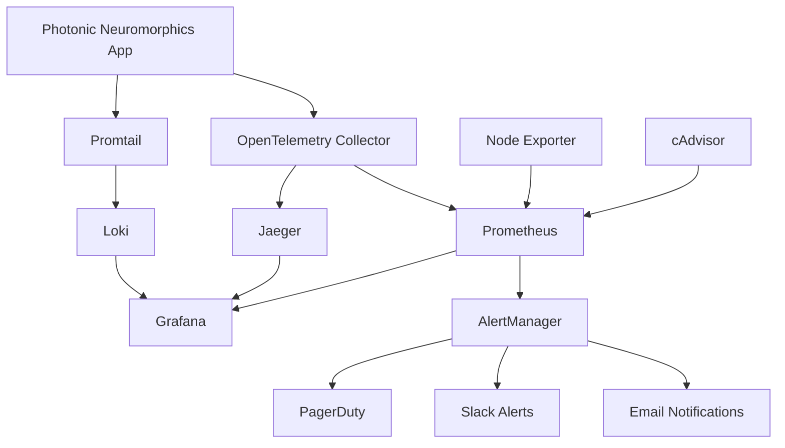

# Monitoring & Observability

Comprehensive monitoring and observability setup for the photonic neuromorphics simulation platform.

## Overview

The monitoring stack provides:
- **Metrics Collection**: Prometheus + OpenTelemetry
- **Log Aggregation**: Loki + Promtail  
- **Distributed Tracing**: Jaeger
- **Visualization**: Grafana dashboards
- **Alerting**: AlertManager with multi-channel notifications
- **Health Monitoring**: Custom health checks and system metrics

## Architecture



## Quick Start

### 1. Start Monitoring Stack

```bash
# Start all monitoring services
cd monitoring
docker-compose -f docker-compose.monitoring.yml up -d

# Check service status
docker-compose -f docker-compose.monitoring.yml ps
```

### 2. Access Dashboards

- **Grafana**: http://localhost:3000 (admin/admin)
- **Prometheus**: http://localhost:9090
- **Jaeger**: http://localhost:16686
- **AlertManager**: http://localhost:9093

### 3. Configure Application

Add to your application configuration:

```python
from photonic_neuromorphics.monitoring import setup_monitoring

# Initialize monitoring
setup_monitoring(
    service_name="photonic-neuromorphics",
    prometheus_endpoint="http://localhost:9090",
    jaeger_endpoint="http://localhost:14268",
    log_level="INFO"
)
```

## Metrics

### Performance Metrics

| Metric | Type | Description |
|--------|------|-------------|
| `simulation_duration_seconds` | Histogram | Time taken for photonic simulation |
| `inference_latency_seconds` | Histogram | Neural network inference time |
| `memory_usage_bytes` | Gauge | Memory usage during simulation |
| `cpu_utilization_percent` | Gauge | CPU utilization percentage |

### Optical Metrics

| Metric | Type | Description |
|--------|------|-------------|
| `optical_power_watts` | Gauge | Optical power levels in waveguides |
| `insertion_loss_decibels` | Gauge | Optical insertion loss |
| `crosstalk_decibels` | Gauge | Optical crosstalk between channels |
| `phase_shift_radians` | Gauge | Phase shift in photonic components |

### Neural Network Metrics

| Metric | Type | Description |
|--------|------|-------------|
| `spike_rate_hertz` | Gauge | Neural spike rate |
| `synaptic_weight` | Gauge | Synaptic weight values |
| `network_accuracy_percent` | Gauge | Neural network accuracy |
| `convergence_iterations_total` | Counter | Iterations to convergence |

### RTL Metrics

| Metric | Type | Description |
|--------|------|-------------|
| `rtl_generation_duration_seconds` | Histogram | RTL generation time |
| `gate_count_total` | Gauge | Total gate count in RTL |
| `area_utilization_square_micrometers` | Gauge | Silicon area utilization |
| `power_consumption_watts` | Gauge | Estimated power consumption |

## Logging

### Log Levels

- **DEBUG**: Detailed debugging information
- **INFO**: General operational messages
- **WARNING**: Warning conditions
- **ERROR**: Error conditions requiring attention
- **CRITICAL**: Critical errors requiring immediate action

### Log Formats

#### Structured JSON Logs
```json
{
  "timestamp": "2025-01-01T10:00:00Z",
  "level": "INFO",
  "name": "photonic_neuromorphics.simulation",
  "module": "waveguide_sim",
  "line": 142,
  "message": "Simulation completed successfully",
  "duration": 15.23,
  "neuron_count": 1000,
  "accuracy": 0.95
}
```

#### Performance Logs
```
2025-01-01 10:00:00 - PERF - photonic_neuromorphics.benchmark - Simulation benchmark: 15.23s for 1000 neurons
```

### Log Collection

Logs are collected from:
- Application logs (`/var/log/photonic/`)
- Container logs (Docker/Kubernetes)
- System logs (`/var/log/syslog`)
- Error logs (separate error tracking)

## Alerting

### Alert Channels

1. **Email**: Team notifications and summaries
2. **Slack**: Real-time team alerts
3. **PagerDuty**: Critical on-call escalation
4. **Webhooks**: Custom integrations

### Alert Severity Levels

- **Critical**: Service down, data loss, security breach
- **Warning**: Performance degradation, resource limits
- **Info**: Operational notifications

### Key Alerts

#### Performance Alerts
- Simulation duration > 5 minutes
- Memory usage > 8GB
- CPU utilization > 90%

#### Optical Alerts
- Insertion loss > 10dB
- Crosstalk > -20dB
- Optical power < 1μW

#### System Alerts
- Service down
- Error rate > 10%
- High request latency

## Dashboards

### System Overview Dashboard
- Service health status
- Resource utilization
- Error rates and latency
- Alert summary

### Photonic Simulation Dashboard
- Optical power levels
- Insertion loss trends
- Crosstalk analysis
- Component performance

### Neural Network Dashboard
- Training progress
- Accuracy metrics
- Spike rate analysis
- Convergence tracking

### RTL Generation Dashboard
- Generation time trends
- Gate count analysis
- Area utilization
- Power consumption

## Troubleshooting

### Common Issues

#### High Memory Usage
```bash
# Check memory-intensive processes
docker-compose exec prometheus promtool query instant 'topk(5, memory_usage_bytes)'

# Review memory configuration
grep -r "memory" monitoring/
```

#### Missing Metrics
```bash
# Check Prometheus targets
curl http://localhost:9090/api/v1/targets

# Verify OpenTelemetry collector
curl http://localhost:13133/
```

#### Log Collection Issues
```bash
# Check Promtail status
docker-compose logs promtail

# Verify log file permissions
ls -la /var/log/photonic/
```

### Performance Tuning

#### Prometheus Optimization
```yaml
# prometheus.yml
global:
  scrape_interval: 30s  # Increase for less load
  evaluation_interval: 30s

# Reduce retention
command:
  - '--storage.tsdb.retention.time=7d'
```

#### Grafana Optimization
```yaml
# grafana.ini
[dashboards]
default_home_dashboard_path = /var/lib/grafana/dashboards/overview.json

[users]
viewers_can_edit = false  # Reduce database writes
```

## Development

### Adding Custom Metrics

```python
from prometheus_client import Counter, Histogram, Gauge

# Define metrics
simulation_counter = Counter(
    'photonic_simulations_total',
    'Total photonic simulations',
    ['model_type', 'status']
)

simulation_duration = Histogram(
    'photonic_simulation_duration_seconds',
    'Simulation duration',
    buckets=[0.1, 1.0, 10.0, 60.0, 300.0]
)

# Use in code
with simulation_duration.time():
    result = run_simulation()
    
simulation_counter.labels(
    model_type='waveguide',
    status='success'
).inc()
```

### Custom Alerts

```yaml
# prometheus/rules/custom_alerts.yml
groups:
  - name: custom.alerts
    rules:
      - alert: CustomMetricHigh
        expr: custom_metric > 100
        for: 5m
        labels:
          severity: warning
        annotations:
          summary: "Custom metric is high"
          description: "Value: {{ $value }}"
```

### Dashboard Development

1. Create dashboard in Grafana UI
2. Export JSON configuration
3. Save to `monitoring/grafana/dashboards/`
4. Add to version control

## Configuration Files

- `monitoring/prometheus.yml` - Prometheus configuration
- `monitoring/prometheus/rules/` - Alerting rules
- `monitoring/alertmanager/alertmanager.yml` - Alert routing
- `monitoring/grafana/provisioning/` - Dashboard and datasource provisioning
- `monitoring/otel/collector-config.yaml` - OpenTelemetry collector
- `monitoring/loki/loki-config.yaml` - Log aggregation
- `monitoring/promtail/promtail-config.yaml` - Log collection

## Environment Variables

```bash
# Required
ENVIRONMENT=production
SMTP_PASSWORD=your_smtp_password
SLACK_WEBHOOK_URL=https://hooks.slack.com/...
PAGERDUTY_ROUTING_KEY=your_pagerduty_key

# Optional
OTEL_API_KEY=your_otel_api_key
INFLUXDB_PASSWORD=your_influxdb_password
AWS_ACCESS_KEY_ID=your_aws_key
AWS_SECRET_ACCESS_KEY=your_aws_secret
POSTGRES_PASSWORD=your_postgres_password
PHOTONIC_API_TOKEN=your_api_token
```

## Security Considerations

1. **Secrets Management**: Use environment variables for sensitive data
2. **Network Security**: Run monitoring on isolated network
3. **Access Control**: Configure Grafana authentication
4. **Data Retention**: Limit metric and log retention periods
5. **Encryption**: Enable TLS for external endpoints

## Maintenance

### Regular Tasks

- Review and update alert thresholds
- Clean up old dashboards
- Monitor storage usage
- Update monitoring stack versions
- Review and rotate secrets

### Backup

```bash
# Backup Grafana dashboards
docker-compose exec grafana grafana-cli admin export-dashboard > backup.json

# Backup Prometheus data
docker run --rm -v prometheus-data:/data -v $(pwd):/backup alpine tar czf /backup/prometheus-backup.tar.gz /data
```

## Integration

### CI/CD Pipeline
- Health check endpoints
- Deployment monitoring
- Performance regression detection
- Alert validation

### External Systems
- SIEM integration
- Ticketing systems
- ChatOps platforms
- Compliance reporting