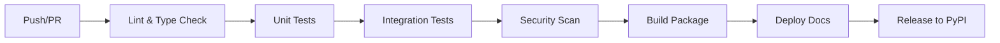

# CI/CD Requirements for Photonic Neuromorphics Sim

This document outlines the CI/CD requirements and provides templates for GitHub Actions workflows. Since GitHub Actions cannot be automatically created, this serves as documentation for manual setup.

## 🏗️ CI/CD Architecture

### Pipeline Overview


## 📋 Required Workflows

### 1. Continuous Integration (.github/workflows/ci.yml)

**Triggers**: Push to main, PRs, daily schedule
**Runner**: ubuntu-latest
**Python Versions**: 3.9, 3.10, 3.11, 3.12

#### Jobs Required:
- **lint**: Black, Ruff, MyPy validation
- **test**: Pytest with coverage reporting  
- **security**: Bandit security analysis
- **build**: Package build verification

#### Environment Setup:
```yaml
# Required environment variables (set in GitHub Secrets)
CODECOV_TOKEN: ${{ secrets.CODECOV_TOKEN }}
SONAR_TOKEN: ${{ secrets.SONAR_TOKEN }}
```

### 2. Documentation Build (.github/workflows/docs.yml)

**Triggers**: Push to main, docs changes
**Runner**: ubuntu-latest

#### Jobs Required:
- **build-docs**: Sphinx documentation build
- **deploy-docs**: GitHub Pages deployment
- **check-links**: Validate external links

### 3. Security Scanning (.github/workflows/security.yml)

**Triggers**: Push to main, weekly schedule
**Runner**: ubuntu-latest

#### Jobs Required:
- **dependency-scan**: Snyk/Safety dependency analysis
- **code-scan**: CodeQL static analysis
- **secret-scan**: GitLeaks secret detection
- **container-scan**: Docker image security (if applicable)

### 4. Release Automation (.github/workflows/release.yml)

**Triggers**: Tag push (v*.*.*)
**Runner**: ubuntu-latest

#### Jobs Required:
- **build-release**: Create distribution packages
- **test-release**: Test installation from built packages
- **publish-pypi**: Upload to PyPI
- **create-github-release**: Generate GitHub release

## 🔧 Required GitHub Settings

### Branch Protection Rules (main branch)
- Require pull request reviews (1 minimum)
- Require status checks to pass
- Require branches to be up to date
- Restrict pushes to specific people/teams
- Include administrators in restrictions

### Required Status Checks
- `lint`
- `test (3.9)`
- `test (3.10)` 
- `test (3.11)`
- `test (3.12)`
- `security`
- `build`

### Secrets Configuration
```bash
# GitHub Secrets to configure:
CODECOV_TOKEN=<codecov_upload_token>
PYPI_API_TOKEN=<pypi_api_token>
SONAR_TOKEN=<sonarcloud_token>
SLACK_WEBHOOK=<notification_webhook>
```

## 📊 Quality Gates

### Code Coverage
- **Minimum**: 80% overall coverage
- **Diff Coverage**: 90% for new code
- **Integration**: Codecov for reporting

### Performance Benchmarks
- **Unit Tests**: < 30 seconds total
- **Integration Tests**: < 5 minutes total
- **Memory Usage**: Monitor for regression

### Security Requirements
- **Dependency Vulnerabilities**: None high/critical
- **Code Scanning**: No security hotspots
- **Secret Detection**: No exposed credentials

## 🚀 Deployment Strategy

### Environment Progression
1. **Development**: Feature branches, automated testing
2. **Staging**: Main branch, full integration testing
3. **Production**: Tagged releases, manual approval

### Release Process
1. **Version Bump**: Update version in pyproject.toml
2. **Changelog**: Update CHANGELOG.md with changes
3. **Tag Creation**: Create git tag (v0.1.0)
4. **Automated Build**: CI builds and tests packages
5. **PyPI Upload**: Automatic upload to PyPI
6. **Documentation**: Update hosted documentation

## 📦 Artifact Management

### Build Artifacts
- **Wheel Packages**: `.whl` files for installation
- **Source Distribution**: `.tar.gz` for pip install
- **Documentation**: HTML docs for hosting
- **Coverage Reports**: For quality monitoring

### Artifact Storage
- **GitHub Releases**: Primary distribution
- **PyPI**: Package index publication
- **GitHub Pages**: Documentation hosting
- **Container Registry**: Docker images (future)

## 🔍 Monitoring and Alerting

### Metrics to Track
- **Build Success Rate**: > 95%
- **Test Execution Time**: Trend monitoring
- **Dependency Security**: Vulnerability count
- **Code Quality**: Technical debt metrics

### Notification Channels
- **Slack Integration**: Build status updates
- **Email Alerts**: Security vulnerabilities
- **GitHub Issues**: Automated bug reports
- **Status Page**: Service health dashboard

## 🛠️ Local Development Integration

### Pre-commit Hooks
- **Automatic Setup**: Run on `make install-dev`
- **Quality Checks**: Format, lint, type check
- **Fast Feedback**: Catch issues before push

### Development Commands
```bash
# Run full CI pipeline locally
make test lint type

# Generate coverage report
make test-cov

# Build documentation
make docs

# Clean build artifacts
make clean
```

## 📋 Workflow Templates

### Basic CI Workflow Structure
```yaml
name: CI
on: [push, pull_request]
jobs:
  test:
    runs-on: ubuntu-latest
    strategy:
      matrix:
        python-version: [3.9, "3.10", 3.11, 3.12]
    steps:
      - uses: actions/checkout@v4
      - name: Set up Python
        uses: actions/setup-python@v4
        with:
          python-version: ${{ matrix.python-version }}
      - name: Install dependencies
        run: pip install -e ".[dev,test]"
      - name: Run tests
        run: pytest --cov=photonic_neuromorphics
```

### Security Scanning Template
```yaml
name: Security
on:
  push:
    branches: [main]
  schedule:
    - cron: '0 6 * * 1'  # Weekly Monday 6 AM
jobs:
  security:
    runs-on: ubuntu-latest
    steps:
      - uses: actions/checkout@v4
      - name: Run Snyk test
        run: |
          npm install -g snyk
          snyk test --file=requirements.txt
```

## 🎯 Implementation Checklist

### Initial Setup
- [ ] Create `.github/workflows/` directory
- [ ] Configure branch protection rules
- [ ] Set up GitHub secrets
- [ ] Configure Codecov integration
- [ ] Set up notification channels

### Workflow Creation
- [ ] Create CI workflow file
- [ ] Create documentation workflow
- [ ] Create security scanning workflow
- [ ] Create release automation workflow
- [ ] Test all workflows with dummy commits

### Quality Integration
- [ ] Configure code coverage reporting
- [ ] Set up dependency vulnerability scanning
- [ ] Enable automated security alerts
- [ ] Configure performance regression detection

### Documentation
- [ ] Document workflow maintenance procedures
- [ ] Create troubleshooting guide
- [ ] Set up workflow status badges
- [ ] Create contributor workflow guide

## 🔄 Maintenance Procedures

### Weekly Tasks
- Review workflow execution metrics
- Update dependencies in workflows
- Check security scan results
- Monitor build performance

### Monthly Tasks
- Review and update quality gates
- Audit GitHub Actions usage
- Update workflow documentation
- Plan workflow improvements

This CI/CD setup provides a robust foundation for the photonic neuromorphics simulation project, ensuring code quality, security, and reliable releases.